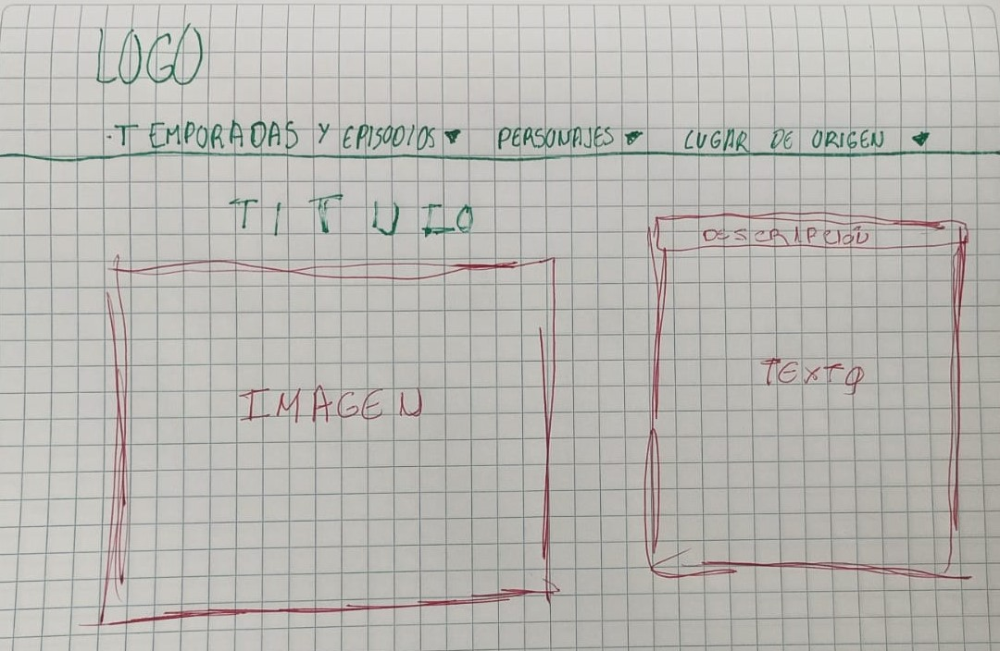
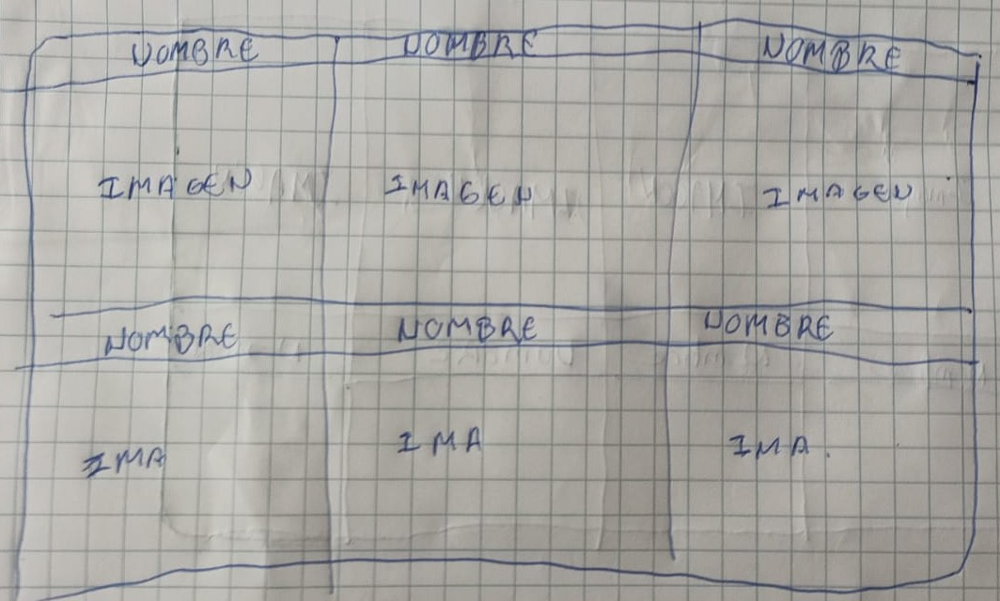

# ADICTED TO ADULT SWIM: Rick and Morty

## Índice

* [1. Introducción](#1-introducción)
* [2. Enfoque del proyecto](#2-enfoque-del-proyecto)
* [3. Entendiendo al usuario](#3-entendiendo-al-usuario)
* [4. Resolviendo la problemática](#4-resolviendo-la-problemática)
* [5. Proceso de diseño](#5-proceso-de-diseño)
* [6. Tests de usabilidad](#6-tests-de-usabilidad)

***

## 1. Introducción

"Rick and Morty" es una serie de televisión estadounidense de animación para adultos creada por Justin Roiland (Pecezuelos, Gravity Falls, etc.) y Dan Harmon (Community, Monster House, etc.) para Adult Swim.  Es transmitida por la aplicación web y la app de Adult Swim, su página web, HBO Max, Netflix y Hulu.  La serie tiene su origen en un corto animado de Roiland, inicialmente llamado "Doc and Mharti", que era una parodia de lo personajes de "Back to the Future".

Todo inicia cuando el genio, irresponsable y algo depresivo Rick se muda a casa de hija y madre de Morty.  Morty en ese momento es un chico tímido, muy nervioso y con una fuerte moral.  A través de sus aventuras espaciales, temporales e intergalácticas, la intención de Rick es hacer de Morty una persona distinta a su padre Jerry, un hombre sin ambiciones e inútil por lo que depende mucho de Beth.  En algunas ocasiones Summer, la hermana de Morty, participa de sus aventuras.

Actualmente cuenta con 5 temporadas, 51 episodios y un especial.  Se estima que la temporada 6 será estrenada en el 2022.

## 2. Enfoque del proyecto

Al ser una serie creada para Adult Swim, cuyo público objetivo son adolescentes y adultos jóvenes varones entre las edades de 18-34, los programas en general contienen violencia gráfica, lenguaje fuerte, humor negro y situaciones surrealistas.

Este público busca información en la web y gustan de los sitios interactivos, pero con una cantidad de texto reducida o de fácil lectura.  De esta forma el sitio debe tener opciones claras que no conlleven a errores o contenido no deseado y también tener una visualización armoniosa con el tema.

## 3. Entendiendo al usuario

Según los seguidores de la serie los datos más relevantes son los personajes y sus biografías (una imagen del personaje, nombre, estado de vida, género, especie y lugar de origen) y el número de episodios.
Debido al tipo de público al que va dirigido, el sitio debe tener información directa, ser interactivo, contar con toda la información relevante y ser responsive.
Es decir, los usuarios de este sitio necesitan:

a. Una página con información centralizada sobre los personajes, con la opción de filtrarla u ordenarla como deseen

b. Una interfaz interactiva y amigable

c. Ser responsive en smartphones, desktops y tablets

## 4. Resolviendo la problemática

En este proyecto crearemos un APIcon la data procurada en el repositorio, en este caso, usando el archivo .json.  Las páginas del proyecto contarán con la estructura básica de un header, section y footer.  Para lograr nuestro objetivo cumpliremos con las siguiente historias de usuario:

#### a. Una página con información centralizada sobre los personajes, con la opción de filtrarla u ordenarla como deseen

* La página debe tener una estructura básica de header, section y footer
* El header debe tener el logo
*	El footer debe tener íconos de redes sociales
*	La página inicia con una breve descripción e imagenes
*	Los personajes se muestran en cards con su imagen, nombre y su información de perfil
*	En la segunda vista se muestra una barra con selects y sus respectivos options para escoger como queremos filtrar en cuanto a  género, especie y estado.
*	En la misma barra debe haber un select para ordenar los resultados por relevancia del personaje, A-Z o Z-A
*	Al lado debe haber un botón para aplicar los filtros y orden, y otro botón para limpiar los datos de búsqueda
*	La página debe regresar a la página principal o puede escoger la página de estadisticas

**Definición de terminado:** la página inicia con todos los personajes, debe filtrar y ordenar los personaje según la elección del usuario y mostrar lo seleccionado.

#### b. Una interfaz interactiva y amigable

*	El logo de la página debe tener un tamaño, color y forma que lo distinga
*	La imagen del header no debe opacar al logo
*	Los botones de la sección de Índice, Lista de personajes y Lista de Episodios deben ser de un color resaltante que pertenezca a la paleta de colores de la serie y tornarse de color gris cuando se pase el mouse por encima
*	La barra de filtrado y ordenado debe tener selects de un color de la paleta y una fuente que la caracterize
*	Los botones de Aplicar y Limpiar Datos deben tener una buena separación y ser de colores distintos para diferenciarlos
*	La barra de filtrado debe ser sticky para acompañar al usuario mientras baja la página
*	Los cards tienen una imagen (con tamaño suficiente para visualizar a los personajes) y su nombre
*	El reverso se muestra girando al pasar el mouse, mostrando su información de perfil
*	Los íconos de redes sociales deben tener una ligera sombra amarilla (como el logo) cuando se pase el mouse
*	Los datos de las creadoras deben ir al medio del footer en un color que resalte y con la sombra de color del logo
*	Al lado derecho de la página debe haber un botón que ayude a regresar a la parte superior de la página

**Definición de terminado:** la página debe ser fácil de utilizar (no conllevar a errores dependiendo de lo que requiera el usuario), los cards deben ser interactivos, la barra de filtrado debe seguir la trayectoria del usuario y la información debe ser fácil de visualizar

#### c. Ser responsive en smartphones, desktops y tablets

*	El documento de CSS debe usar porcentajes o la unidad vw para ajustar todas las opciones a varias pantallas de diferentes tamaños
*	En los documentos de HTML debemos usar la etiqueta de meta, de atributo name "viewport", content "width=device-width, initial-scale=1.0"
*	Mostrar tarjetas más pequeñas
*	Que el menú desplegable se mantenga en la parte superior y acompañe cuando se hace el scrolling
*	Las funcionalidades de la página se deben mantener en cualquier dispositivo
*	Rediseñar para adaptarlo a teléfonos, tablets,etc

**Definición de terminado:** la página debe ser visible y navegable desde una desktop, un celular o una tablet

#### d. Contar con una bienvenida, lista de episodios y listado de personajes

*	En la barra de navegación tendremos un Índice, Lista de Personajes y Lista de Episodios
*	El index del sitio debe ser un Índice con la misma estructura, pero en su section irá una bienvenida, breve descripción del sitio y un carrusel con imágenes de la serie y algunos datos curiosos
*	La página de Lista de Personajes incluirá a los personajes y las funciones de filtrar y ordenar, con sus resultados
*	La página de Lista de Episodios incluirá las carátulas de cada temporada y al pasar el mouse por encima la imagen es cubierta por un recuadro de color celeste con el nombre de la temporada y sus episodios.

**Definición de terminado:** el sitio completo debe ser 100% funcional y pasar por el tests de usabilidad con el despliegue en GitHub pages

## 5. Proceso de diseño

**Prototipos de papel**

**Prototipos de alta fidelidad**

**Prototipo final**

## 6. Tests de usabilidad

A medida que fuimos desarrollando el sitio surgieron algunos cambios de diseño para mejor lectura, accesibilidad y orden. Como por ejemplo:

*	Cambiar los botones del nav a gris cuando se pase el mouse por encima o cuando se elija esa página
*	Cambiar el cursor por pointer al pasar por los botones de navegación
*	Hacer la descripción del sitio más corta
*	Hacer scroll para ver la lista de personajes
*	Agregar la cantidad de resultados de la búsqueda al filtrar
*	Colocar un botón para regresar arriba en la página de personajes
* Arreglar el orden en la barra de filtrado cuando se usa en otros dispositivos
* Poder filtrar por estado de vida
* Cambiar fuentes de los labels

